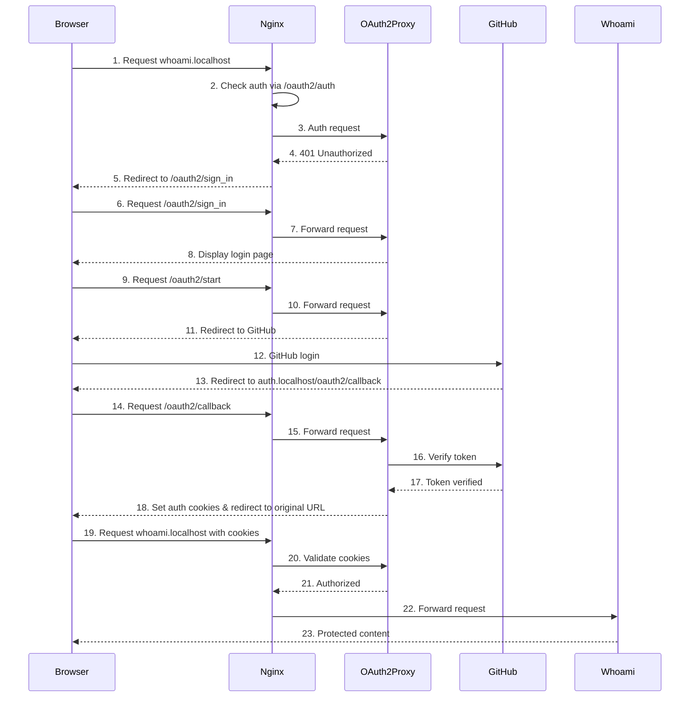

# Nginx Reverse Proxy with OAuth2 Authentication

This directory contains Nginx configurations for a reverse proxy with GitHub OAuth2 authentication.

## Authentication Workflow



## Authentication Steps and Configuration

1. **Initial Request** (whoami.conf)
   - User navigates to `whoami.localhost`
   - Nginx processes the request using the server block in `whoami.conf`
   - The `location /` block includes `auth_request /oauth2/auth` directive

2. **Authentication Check** (whoami.conf)
   - Nginx makes a subrequest to `/oauth2/auth` endpoint
   - This is handled by the `location = /oauth2/auth` block in `whoami.conf`
   - The request is proxied to the oauth2-proxy service

3. **Authentication Failure Handling** (whoami.conf)
   - If authentication fails (401), Nginx redirects to `/oauth2/sign_in`
   - This is configured with `error_page 401 =403 /oauth2/sign_in`
   - The `/oauth2/sign_in` request is handled by the `location /oauth2/` block

4. **OAuth2 Flow Initiation** (whoami.conf, docker-compose.yml)
   - User clicks "Sign in with GitHub" button
   - Browser requests `/oauth2/start`
   - OAuth2 Proxy redirects to GitHub
   - This is configured in the oauth2-proxy service with:
     - `OAUTH2_PROXY_PROVIDER=github`
     - `OAUTH2_PROXY_CLIENT_ID` and `OAUTH2_PROXY_CLIENT_SECRET`

5. **GitHub Authentication** (external)
   - User authenticates with GitHub
   - GitHub redirects back to the configured callback URL

6. **OAuth2 Callback Handling** (auth.conf, docker-compose.yml)
   - GitHub redirects to `auth.localhost/oauth2/callback`
   - This is handled by the server block in `auth.conf`
   - The callback URL is configured in docker-compose.yml with:
     - `OAUTH2_PROXY_REDIRECT_URL=http://auth.localhost/oauth2/callback`

7. **Session Creation** (auth.conf, docker-compose.yml)
   - OAuth2 Proxy validates the callback
   - Creates session cookies
   - Cookie settings are configured with:
     - `OAUTH2_PROXY_COOKIE_NAME=_oauth2_proxy`
     - `OAUTH2_PROXY_CSRF_COOKIE_NAME=_oauth2_proxy_csrf`
     - `OAUTH2_PROXY_COOKIE_DOMAINS=.localhost`

8. **Authenticated Access** (whoami.conf)
   - User is redirected back to the original URL
   - Nginx verifies the authentication cookies
   - Forwards the request to the whoami service
   - This is configured with `proxy_pass http://whoami:8000`

## Configuration Elements Explained

### auth.conf
- **Purpose**: Handles the OAuth2 callback domain (auth.localhost)
- **Key Elements**:
  - `server_name auth.localhost`: Matches the callback URL in oauth2-proxy configuration
  - `proxy_pass http://oauth2-proxy:4180`: Forwards requests to the OAuth2 Proxy service
  - `proxy_cookie_domain` and `proxy_cookie_path`: Critical for CSRF token handling

### whoami.conf
- **Purpose**: Protects the whoami service with authentication
- **Key Elements**:
  - `auth_request /oauth2/auth`: Requires authentication for accessing the service
  - `error_page 401 =403 /oauth2/sign_in`: Redirects unauthenticated users to sign in
  - `auth_request_set $auth_cookie`: Captures cookies from the auth service
  - `add_header Set-Cookie $auth_cookie`: Sets the auth cookies in the response

### default.conf
- **Purpose**: Handles requests to unknown hosts
- **Key Elements**:
  - `listen 80 default_server`: Catches all requests not matching other server names
  - `return 404`: Returns a 404 error for unknown hosts

### docker-compose.yml (oauth2-proxy service)
- **Purpose**: Configures the OAuth2 Proxy service
- **Key Elements**:
  - `OAUTH2_PROXY_PROVIDER=github`: Uses GitHub as the authentication provider
  - `OAUTH2_PROXY_REDIRECT_URL`: Specifies the callback URL
  - Cookie configuration: Name, domains, security settings, CSRF protection

## Unnecessary Configuration Elements

The following elements could be considered for removal to simplify the configuration:

1. In whoami.conf:
   - Duplicate proxy header settings in multiple location blocks
   - The specific `/oauth2/callback` location block if not needed separately

2. In docker-compose.yml:
   - All commented-out services and configurations
   - Potentially redundant environment variables in the oauth2-proxy service

3. General:
   - The docker.sock volume mount in nginx-proxy if not using container auto-discovery
   - Redundant proxy headers that aren't used by the services

## Reusable OAuth2 Configuration

To avoid duplicating OAuth2 configuration across multiple webapp configurations, a common `oauth2.conf` file has been created:

1. **oauth2.conf**: Contains the common OAuth2 configuration that can be included in any webapp configuration
   - Location blocks for `/oauth2/` and `/oauth2/auth`
   - Proxy settings for the OAuth2 Proxy service
   - CSRF cookie handling

### Adding a New Protected Webapp

To add a new webapp with OAuth2 authentication:

1. Create a new configuration file in `nginx/conf.d/` (e.g., `myapp.conf`)
2. Include the common OAuth2 configuration with `include /etc/nginx/conf.d/oauth2.conf;`
3. Add the protected location block with `auth_request /oauth2/auth;`

Example:
```nginx
server {
    listen 80;
    server_name myapp.localhost;

    # Common proxy headers
    proxy_set_header Host $host;
    proxy_set_header X-Real-IP $remote_addr;
    proxy_set_header X-Forwarded-For $proxy_add_x_forwarded_for;
    proxy_set_header X-Forwarded-Proto $scheme;

    # Include common OAuth2 configuration
    include /etc/nginx/conf.d/oauth2.conf;

    location / {
        auth_request /oauth2/auth;
        error_page 401 =403 /oauth2/sign_in;

        # Cookie refresh handling
        auth_request_set $auth_cookie $upstream_http_set_cookie;
        add_header Set-Cookie $auth_cookie;

        # Proxy to your app service
        proxy_pass http://myapp-service:8080;
    }
}
```
