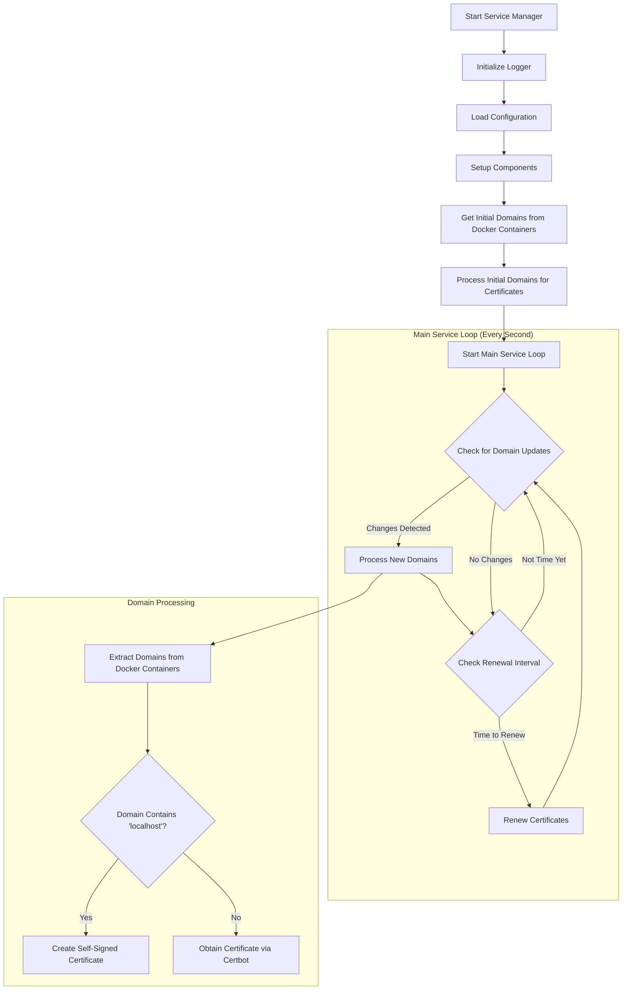

# Service Manager

Service Manager is a Go implementation for managing services, including SSL certificates. It replaces the previous Certobot-Go implementation while expanding functionality.

## Features

- Extracts domains from Docker containers with VIRTUAL_HOST environment variable
- Manages SSL certificates using certbot or self-signed certificates for localhost domains

## Configuration

The service is configured using environment variables:

- `EMAIL`: (Required) Email address for certificate registration
- `LOG_LEVEL`: (Optional) Log level (debug, info, warn, error). Defaults to "info"

## Architecture

The application is structured into several packages:

- `config`: Configuration handling
- `certificate`: Certificate management
- `docker`: Docker container interaction

### Process Flow Diagram



## Building and Running

### Building the Docker Image

```bash
docker build -t service-manager .
```

### Running with Docker Compose

The service is integrated into the docker-compose.yml file and can be run with:

```bash
docker-compose up -d
```

## Testing

Run the tests with:

```bash
go test ./...
```

## License

Same as the parent project.
