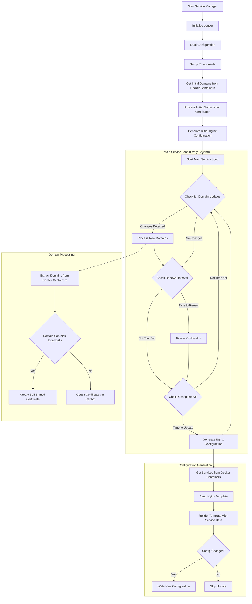

# Service Manager

Service Manager is a Go implementation for managing services, including SSL certificates and Nginx configuration generation. It replaces the previous Certobot-Go implementation and integrates the functionality of the nginx-conf-gen service, providing a unified solution for service management.

## Features

- Extracts domains from Docker containers with VIRTUAL_HOST environment variable
- Manages SSL certificates using certbot or self-signed certificates for localhost domains
- Generates Nginx configuration files based on Docker container information
- Supports authentication configuration for services with WITH_AUTH and WITH_AUTH_HEADERS environment variables
- Automatically detects changes in container configuration and updates Nginx accordingly

## Configuration

The service is configured using environment variables:

### Certificate Management
- `EMAIL`: (Required) Email address for certificate registration
- `LOG_LEVEL`: (Optional) Log level (debug, info, warn, error). Defaults to "info"

### Configuration Generation
- `TEMPLATE_PATH`: (Optional) Path to the Nginx template file. Defaults to "/app/template/service.conf.mustache"
- `OUTPUT_PATH`: (Optional) Path to write the generated configuration. Defaults to "/app/output/services.conf"
- `CONFIG_INTERVAL`: (Optional) Interval for configuration generation checks. Defaults to "30s"
- `AUTH_SERVICE`: (Optional) Service to use for authentication (e.g., "oauth2-proxy:4180")

## Architecture

The application is structured into several packages:

- `config`: Configuration handling
- `certificate`: Certificate management
- `docker`: Docker container interaction
- `nginx`: Nginx configuration generation

### Process Flow Diagram



## Container Configuration

The service-manager detects and configures services based on environment variables set in Docker containers:

- `VIRTUAL_HOST`: (Required) Domain name for the service (e.g., "example.com")
- `WITH_AUTH`: (Optional) Enable authentication without passing headers to the service
- `WITH_AUTH_HEADERS`: (Optional) Enable authentication and pass user information headers to the service

When a container with these environment variables is started or stopped, the service-manager automatically detects the change and updates the Nginx configuration accordingly.

## Building and Running

### Building the Docker Image

```bash
docker build -t service-manager .
```

### Running with Docker Compose

The service is integrated into the docker-compose.yml file as the "nginx-services" service and can be run with:

```bash
docker-compose up -d
```

This will start the service-manager along with Nginx and other required services.

## Testing

Run the tests with:

```bash
go test ./...
```

## License

Same as the parent project.
